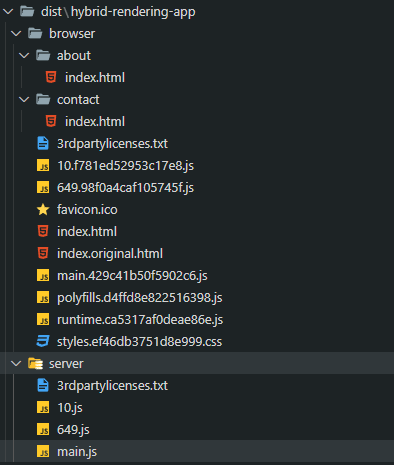
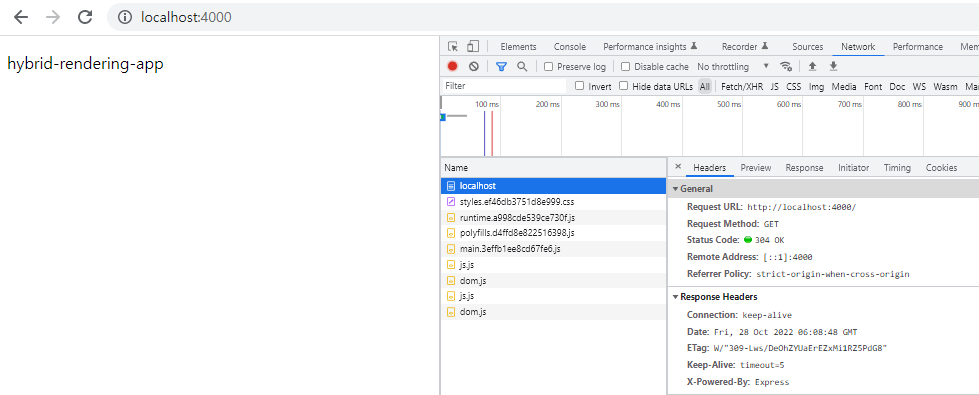
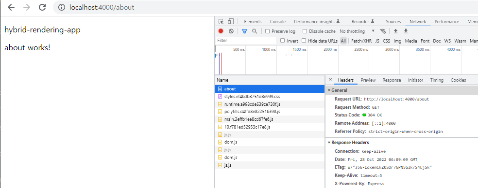
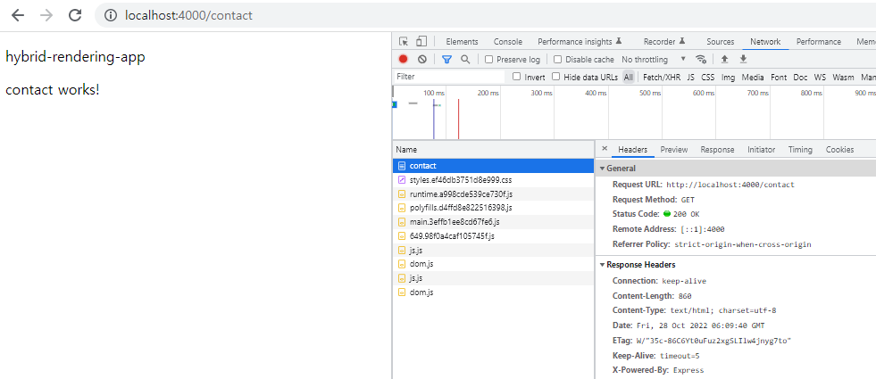

이전 글에서 CSR, SSR, SSG에 대해 각각의 차이점에 대해서 다뤄 보았습니다. Angular, React, Vue에서 각각의 방식으로 이러한 렌더링 방식으로 구현을 할 수가 있는데요. 대표적으로 Angular는 Universal, React는 NextJs, Vue는 Nuxt 등을 많이 사용하는 것 같네요. Angular는 국내에서 인기가 많이 없어서인지 해당 내용을 다루는 글이 없는듯하여 이번 기회에 제가 사용을 해보고 간단하게나마 정리해보겠습니다.

렌더링 종류에 대한 글은 [여기](https://devtimes.com/server-client-side-rendering/)를 참고

결론부터 말씀드리면 굉장히 쉽습니다!

먼저 간단하게 개념 정도만 다시 짚고 넘어가겠습니다.

## PreRendering

우리에게 가장 익숙한 클라이언트 렌더링(CSR) 방식은 잘 아실 테고, 서버사이드 렌더링(SSR)은 각 페이지에 대한 요청을 받으면 브라우저 엔진을 대신해서 서버에서 Node가 렌더링하고 결과물을 클라이언트에서 전달해주는 것이고, 사전 렌더링(PreRendering, SSG) 말 그대로 미리 렌더링을 해놓고 서버에서 해당 페이지에 대한 요청이 오면 미리 렌더링해두었던 페이지를 전달!

자 이제 누구도 알려주지 않았던, Angular Universal을 이용해 하이브리드 렌더링을 구현해 보겠습니다.

## Universal

`hybrid-rendering-app` 이라는 새로운 프로젝트를 생성하고 universal package를 추가해줍니다.

~~~bash
ng new hybrid-rendering-app

ng add @nguniversal/express-engine
~~~

`@nguniversal/express-engine`을 추가 해주면 `main.server.ts`, `app.server.module.ts`과 같은 뭔가 못보던 파일들이 생겨나는 것을 보실수 있습니다. 우리는 지금껏 브라우저 환경에서 클라이언트 렌더링을 사용했지만, 이제 브라우저 환경이 아닌곳에서 렌더링을 해야 하기 때문에 Node가 실행해줄 파일이 필요하기 때문입니다.

`package.json` 파일을 보면 처음 보는 scripts들도 확인 할 수 있습니다.
~~~
    "dev:ssr": "ng run hybrid-rendering-app:serve-ssr",
    "serve:ssr": "node dist/hybrid-rendering-app/server/main.js",
    "build:ssr": "ng build && ng run hybrid-rendering-app:server",
    "prerender": "ng run hybrid-rendering-app:prerender"
~~~
키값명칭을 보면 대충 어떤것을 하는것이겠구나.. 하는 정도의 감은 오셨을 겁니다.

먼저 `prerendering`을 해보기 위해 route 페이지가 필요한데, about와 contact 모듈을 추가하고 라우터에 등록 시켜보겠습니다.

각각의 컴포넌트를 생성해 router에 등록해도 되지만 아래와 같은 명령어를 통해 쉽게 추가할 수 있습니다. (Angular 프레임웍의 장점 이기도 하죠, 복잡해 보이지만 체계적이다? ^^;)

~~~bash
ng g m about --route about --module app

ng g m contact --route contact --module app
~~~

## Run

바로 사전 렌더링을 해보죠!

~~~
npm run prerender
~~~

dist 디렉토리를 보시면 server, browser 두개의 디렉토리로 나누어져 있네요. server/main.js 이 파일이 node에서 실행해주는 파일이 되는것이고요, browser 디렉토리 내부에 있는 파일들이 렌더링된 파일들입니다. 그런데 index.html 파일만 있는게 아니고 router에 등록한 about, contact의 index.html파일도 각각의 디렉토리에 생성이 되었습니다.
각각의 페이지 요청이 오면 미리 랜더링해둔 index.html파일을 전달하기 위함이죠.

## Options

그리고 `angular.json` 파일의 옵션정보를 이용해서 원하는 페이지만 사전 렌더링을 해둘수가 있습니다. 예를 들어 about 페이지만 사전 렌더링을 해두고 싶다. 그럼 `"guessRoutes": false`, `"routes"` 배열에 렌더링할 페이지만 추가해줍니다.

projects > hybrid-rendering-app > architect > prerender

~~~
"options" : {
  "guessRoutes": false,
  "routes": [
    "/about"
  ]
}
~~~

"routesFile": "./routes.txt" 파일에 경로들을 설정할수도 있습니다.

더 자세한 `options` 정보는 [여기](https://angular.io/guide/prerendering#build-options-for-prerendering)에서 확인해 주세요

이제 node로 해당 js파일을 실행해주면 됩니다.

## Server Start

~~~
node dist\hybrid-rendering-app\server\main.js
~~~

Node Express server listening on http://localhost:4000

서버를 구동해주고 브라우저에 접속해서 Network 탭을 살펴 보면 각 라우팅에 접근할 때마다 해당 문서를 다운받는 것을 확인할 수 있습니다.

`main`

`about`

`contact`

최초 접속시 index.html 파일을 받아 그안에서 javascript 파일에 의해 동적으로 문서를 변경하는 SPA방식과는 달리 라우터 접근시 사전에 렌더링된 문서를 서버에서 전달해주게 됩니다.

거의 변경이 없는 페이지들의 경우 이렇게 사전에 렌더링을 해두면 성능적인 부분에서 매우 효휼적일 것이지만, 페이지 내용이 자주 변경이 된다거나 게시판 같은 동적인 라우팅을 사용한다면, `options`에 렌더링할 페이지만 명시해주면 선택적으로 사전 렌더링을 할 수 있게 되는 것 입니다.