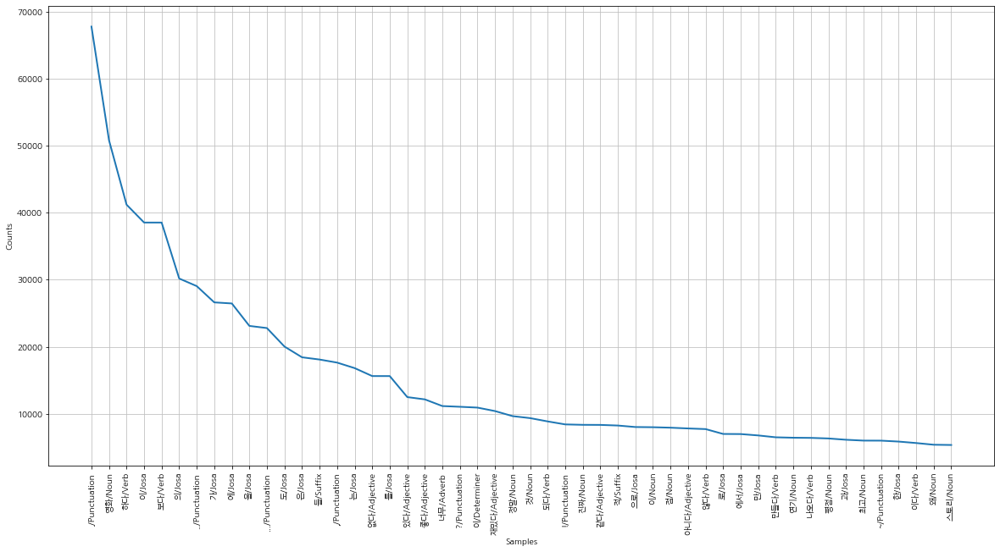

한국어 데이터에 대해서 텍스트 분석을 해보자. 아래 데이터는 한국어 분석 학습을 위해 다양한 방식으로 사용되고 있다. 여기서는 한글 분석을 위해 Konlpy를 사용하고, 텐서플로 케라스를 이용해 모델을 만들도록 하겠다.

**데이터셋 : Naver sentiment movie corpus** 
(다운로드 링크 : https://github.com/e9t/nsmc/)

NSMC 약어까지 사용할 정도로 많이들 사용하는 데이터 인듯 싶다.

**데이터 설명**

영화 리뷰 중 영화당 100개의 리뷰이고 총 200,000개의 리뷰(train:15만, test:5만)

1점 ~ 10점 까지의 평점 중에서 중립적인 평점(5점~8점)을 제외하고 분류를 하였다.
- 부정 : 1점 ~ 4점
- 긍정 : 9점 ~ 10점

칼람정보: id, document, label
- id: 리뷰 아이디
- document: 리뷰 내용
- label: 레이블 (0: negative, 1: positive)

각 파일에 대한 리뷰 갯수
- ratings.txt: All 20만
- ratings_test.txt: 5만
- ratings_train.txt: 15만

모든 리뷰텍스트는 140자 이내이고, 각 감정 분류는 동일하게 샘플링 된다.(i.e., random guess yields 50% accuracy)
- 10만개의 부정적인 리뷰
- 10만개의 긍정적인 리뷰
- 중립적인 리뷰는 제외

### 데이터 준비

다운로드 받은 데이터를 pandas를 이용해 읽어보자. 필드 구문이 탭으로 되어 있기 때문에 `\t`로 구분자를 지정해주어야 한다.

```python
import pandas as pd

train_df = pd.read_csv("data_naver_movie/ratings_train.txt", "\t")
test_df = pd.read_csv("data_naver_movie/ratings_test.txt", "\t")
```

### 데이터 전처리

데이터를 학습 시키기 위해 전처리를 진행해야 하는데, Konlpy를 이용해 `형태소 분석 및 품사 태깅`을 하도록 하자.

영어의 경우 주어진 단어의 빈도만을 사용해서 처리해도 크게 문제는 없지만 한국어는 영어와는 달리 띄어쓰기로 의미를 구분짓기에는 한계가 있고, 리뷰 특성상 맞춤법이나 띄어쓰기가 제대로 되어있지 않는 경우가 있을 수 있기 때문에 정확한 분류를 위해서는 Konlpy를 이용하는 것이 좋다.

>Konlpy는 띄어쓰기 알고리즘과 정규화를 이용해서 맞춤법이 틀린 문장도 어느 정도 고쳐주면서 형태소 분석과 품사를 태깅해주는 여러 클래스를 제공하고 있다.^^!

```python
from konlpy.tag import Okt
okt = Okt()
okt.pos(u'흔들리는 꽃들 속에서 네 샴푸향이 느껴진거야')
```

    [('흔들리는', 'Verb'),
     ('꽃', 'Noun'),
     ('들', 'Suffix'),
     ('속', 'Noun'),
     ('에서', 'Josa'),
     ('네', 'Noun'),
     ('샴푸', 'Noun'),
     ('향', 'Noun'),
     ('이', 'Josa'),
     ('느껴진거야', 'Verb')]


테스트 삼아 간단한 문장을 넣고 확인 해보면 이런 형태로 분리를 해주는 것을 알수 있다.

토크나이즈 함수를 만들어 사용하도록 한다.

```python
def tokenize(doc):
    #형태소와 품사를 join
    return ['/'.join(t) for t in okt.pos(doc, norm=True, stem=True)]
```
>norm은 정규화, stem은 근어로 표시하기를 나타냄

리뷰가 null인 경우 위 위 함수에서 오류가 발생할 수 있으니 사전에 null값 확인해보고 빈민자열로 대체하자!

```python
train_df.isnull().any() #document에 null값이 있다.
train_df['document'] = train_df['document'].fillna(''); #null값을 ''값으로 대체

test_df.isnull().any()
test_df['document'] = test_df['document'].fillna(''); #null값을 ''값으로 대체
```

이제 학습데이터와 테스트데이터를 분석하여 저장해두자.

```python
#tokenize 과정은 시간이 오래 걸릴수 있음...
train_docs = [(tokenize(row[1]), row[2]) for row in train_df.values]
test_docs = [(tokenize(row[1]), row[2]) for row in test_df.values]
```

분석결과가 끝났으면 다음과 같은 형태로 데이터가 변형 되었을 것이다.

```python
print(train_docs[0])
print(test_docs[0])
```

    (['아/Exclamation', '더빙/Noun', '../Punctuation', '진짜/Noun', '짜증나다/Adjective', '목소리/Noun'], 0)
    (['굳다/Adjective', 'ㅋ/KoreanParticle'], 1)
    

15만 학습데이터에 분리된 토큰 개수를 살펴보자.

```python
tokens = [t for d in train_docs for t in d[0]]
print("토큰개수:", len(tokens))
```

    토큰개수: 2159921
    
이제 이데이터를 가지고 nltk를 이용해 전처리를 한다. `Text` 클래스는 문서를 편리하게 탐색할 수 있는 다양한 기능을 제공하고 있다.

여기서는 `vocab().most_common` 매서드를 이용해 데이터가 가장 자주 사용되는 단어를 가져올 때 사용하겠다.

```python
import nltk
text = nltk.Text(tokens, name='NMSC')

#토큰개수
print(len(text.tokens))

#중복을 제외한 토큰개수
print(len(set(text.tokens)))

#출력빈도가 높은 상위 토큰 10개
print(text.vocab().most_common(10))
```

    2159921
    49894
    [('./Punctuation', 67778), ('영화/Noun', 50818), ('하다/Verb', 41209), ('이/Josa', 38540), ('보다/Verb', 38538), ('의/Josa', 30188), ('../Punctuation', 29055), ('가/Josa', 26627), ('에/Josa', 26468), ('을/Josa', 23118)]
    

### 데이터 탐색

출력빈도가 높은 상위 토큰 10개를 matplotlib을 이용해 그래프로 확인해보자.

```python
%matplotlib inline
```

```python
import matplotlib.pyplot as plt
from matplotlib import font_manager, rc
plt.figure(figsize=(20,10))
text.plot(50)
```




모델을 만들기 위해 백터화를 해야 하는데, 자주 사용되는 토큰 10000개를 사용해 데이터를 백터화 하자.(원 핫 인코딩 대신 CountVectorization을 사용)

문서 집합에서 단어 토큰을 생성하고 각 단어의 수를 세어 BOW(Bag of Words) 인코딩한 벡터를 만드는 역할을 한다.

시간이 오래 걸리므로 100개만 해보자...


```python
FREQUENCY_COUNT = 100; #시간적 여유가 있다면 10000개를 해보도록~
```

```python
selected_words = [f[0] for f in text.vocab().most_common(FREQUENCY_COUNT)]
```

이 과정은 데이터 양이 큰 만큼 시간이 오래 걸리기 때문에 이 작업을 반복하지 않도록 태깅을 마친 후에는 json파일로 저장하는 것도 좋은 방법이다.

문서에서 상위로 선택된 단어들중 몇개가 포함이 되는지를 알아야 한다.

```python
#단어리스트 문서에서 상위 10000개들중 포함되는 단어들이 개수
def term_frequency(doc):
    return [doc.count(word) for word in selected_words]
```

```python
#문서에 들어가는 단어 개수
x_train = [term_frequency(d) for d,_ in train_docs]
x_test = [term_frequency(d) for d,_ in test_docs]
```

```python
#라벨(1 or 0)
y_train = [c for _,c in train_docs]
y_test = [c for _,c in test_docs]
```

이렇게 하면 x축 데이터에는 단어들이 빈도수 정보?, y축에는 분류 결과를 깔끔하게 정리할 수 있다.

이제 데이터를 float로 형 변환 시켜주면 데이터 전처리 과정은 끝~~

```python
x_train = np.asarray(x_train).astype('float32')
x_test = np.asarray(x_test).astype('float32')

y_train = np.asarray(y_train).astype('float32')
y_test = np.asarray(y_test).astype('float32')
```

### 데이터 모델링

텐서플로 케라스를 이용해 모델을 만들어 보자.

레이어 구성은 두개의 Danse층은 64개의 유닛을 가지고 활성함수는 relu를 사용하고, 마지막층은 sigmoid 활성화 함수를 사용해 긍정 리뷰일 확률을 출력할 것이다.

```python
import tensorflow as tf

#레이어 구성
model = tf.keras.models.Sequential([
    tf.keras.layers.Dense(64, activation='relu', input_shape=(FREQUENCY_COUNT,)),
    tf.keras.layers.Dense(64, activation='relu'),
    tf.keras.layers.Dense(1, activation='sigmoid')
])
```

손실 함수는 binary_crossentropy, RMSprop 옵티마이저를 통해 경사하강법을 진행

```python
#학습 프로세스 설정
model.compile(optimizer=tf.keras.optimizers.RMSprop(lr=0.001),
    loss=tf.keras.losses.binary_crossentropy,
    metrics=[tf.keras.metrics.binary_accuracy]
    )
```

배치 사이즈는 512, 에포크는 10번으로 학습

자, 이제 학습을 시켜 모델을 만들어 보자! 먼가 있어 보이는 진행률 상태를 볼 수 있다.:)

```python
#학습 데이터로 학습
model.fit(x_train, y_train, epochs=10, batch_size=512)
```

    WARNING:tensorflow:From C:\Users\DESKTOP\.conda\envs\nlp\lib\site-packages\tensorflow\python\ops\math_ops.py:3066: to_int32 (from tensorflow.python.ops.math_ops) is deprecated and will be removed in a future version.
    Instructions for updating:
    Use tf.cast instead.
    Epoch 1/10
    150000/150000 [==============================] - 17s 115us/sample - loss: 0.5611 - binary_accuracy: 0.6948s - loss: 0.6134 - binary_accuracy:  - ETA: 21s - loss: 0.6108 - binary_accuracy: 0. - ETA: 20s -  - ETA: 15s - loss: 0.5957 - binary_accuracy: 0.67 - ETA: 15s - loss: 0.5955 - binary_accuracy: 0.67 - ETA: 15s - loss: 0.5951 - binary_accura - ETA: 14s - loss: 0.5930 - binary_accuracy: 0. - ETA: 14s - loss: 0.5923 - binary_accuracy:  - ETA: 13s - loss: 0.5911 - binary_accura - ETA: 8s - loss: 0.5785 - binary_accuracy: 0. - ETA: 8s - loss: 0.5771 - binary_accuracy: 0.68 - ETA: 8s - loss: 0.5764 - binary_accuracy:  - ETA: 7s - loss: 0.5751 - binary_accura - ETA: 6s - loss: 0.5727 - binary_accuracy: - ETA: 6s - loss: 0.5713 - binary_accuracy: 0.6 - ETA: 5s - loss: 0.5708 - binary_a - ETA: 4s - loss: 0.5685 - binary_accuracy: - ETA: 4s - loss: 0.5676 - binary_accuracy: 0.691 - ETA: 4s - loss: 0.5674 - binary_a - ETA: 2s - loss: 0.5652 - binary_accuracy: 0.692 - ETA: 2s - loss: 0.5651 - binary_accurac - ETA: 1s - loss: 0.5639 - binary_accuracy - ETA: 1s - loss: 0.5628 - binary_accuracy: 0.694 - ETA: 1s - loss: 0.5627 - binary_accuracy: 0.694 - ETA: 1s - loss: 0.5626 - binary_accuracy: 0.694 - ETA: 1s - loss: 0.5623 - binary_accuracy: 0.694 - ETA: 1s - loss: 0.5623 - binary_accuracy:  - ETA: 0s - loss: 0.5615 - binary_accuracy: 0.69 - ETA: 0s - loss: 0.5612 - binary_accuracy: 0.694 - ETA: 0s - loss: 0.5613 - binary_accuracy: 0.6
    Epoch 2/10
    150000/150000 [==============================] - 12s 83us/sample - loss: 0.5313 - binary_accuracy: 0.71254s - loss: 0.5221 - binary_ac - ETA: 15s - loss: 0.5345 - binary_accuracy:  - ETA: 16s - loss: 0.5377 - binary_accuracy - ETA: 14s - loss - ETA: 13s - lo - ETA: 7s - loss: 0.5341 - binary_accuracy: 0.71 - ETA: 7s -  - ETA: 4s - loss: 0.5340 - binary_accur - ETA: 3s - loss: 0.5335 - binary_accuracy: 0.71 - ETA: 3s - loss: 0.5335 - binary_ - ETA: 2s - loss: 0.5325 - binary_accuracy: 0 - ETA: 1s - loss: 0.
    Epoch 3/10
    150000/150000 [==============================] - 13s 86us/sample - loss: 0.5236 - binary_accuracy: 0.7170s - loss: 0.5284 - binary_accuracy - ETA: 10s - los - ETA: 9s - loss: 0.5255 - binary_accurac - ETA: 9s - loss: 0.5250 - binary_accuracy: 0. - ETA: 9s - loss: 0.5255 - binary_accuracy: 0.716 - ETA: 9s - loss: 0.5254 - binary - ETA: 8s - loss: 0.5247 - binary_acc - ETA: 7s - loss: 0.5251 - binary_accuracy: 0.7 - ETA: 7s - loss: 0.5252 - binary_accuracy: 0.71 - ETA: 7s - loss: 0.5249 - binary_accuracy: 0.716 - ETA: 7s - loss: 0.5248 - binary_accuracy: 0.7 - ETA: 6s - loss: 0.5245 - binary_accuracy: - ETA: 6s - loss: 0.5246 - binary_accuracy: 0 - ETA: 5s - loss: 0.5247 - bina - ETA: 5s - loss: 0.5249 - b - ETA: 3s - loss: 0.5246 - binary_ac - ETA: 2s - loss: 0.5246 - binary_ac - ETA: 2s - loss: 0.5244 - binary_accuracy: 0.71 - ETA: 2s - loss: 0.5244 - binary_accuracy: - ETA: 1s - loss: 0.5242 - binary_accur - ETA: 1s - loss: 0.5243 - binary_accuracy: 0 - ETA: 0s - loss: 0.5243 - binary_accuracy - ETA: 0s - loss: 0.5239 - binary_accuracy: 0.7 - ETA: 0s - loss: 0.5237 - binary_accuracy: 0.7 - ETA: 0s - loss: 0.5236 - binary_accuracy: 0.71
    Epoch 4/10
    150000/150000 [==============================] - 13s 89us/sample - loss: 0.5179 - binary_accuracy: 0.7219s - loss: 0.5201 - binary_accuracy: 0 - ETA: 8s - loss: 0.5211 - binary_a - ETA: 9s - loss: 0.5208 - binary_accuracy: 0.721 - ETA: 8s - loss: 0.5201 - binary_accuracy: 0.72 - ETA: 8s - loss: 0.5210 - - ETA: 7s - loss: 0.5180 - binary_ac - ETA: 7s - loss: 0.5187 - binar - ETA: 6s - loss: 0.5186 - binary_accura - ETA: 6s - loss: 0.5183 - binary_accuracy: 0.7 - ETA: 6s - loss: 0.5182 - binary_ac - ETA: 5s - loss: 0.5179 - binary_accuracy: 0.723 - ETA: 5s - loss: 0.5179 - binary_accurac - ETA: 4s - loss: 0.5187 - binary_accuracy: 0.722 - ETA: 4s - lo
    Epoch 5/10
    150000/150000 [==============================] - 13s 87us/sample - loss: 0.5132 - binary_accuracy: 0.72531s - loss: 0.5093 - binary_accuracy: 0.72 - ETA: 11s - ETA: 9s - loss: 0.5156 - binary_accuracy: 0.7 - ETA: 9s - loss: 0.5163 - binary_accuracy:  - ETA: 9s - loss: 0.5154 - binary_accurac - ETA: 8s - loss: 0.5164 - bin - ETA: 7s - loss: 0.5156 - binary - ETA: 6s - loss: 0.5168 - binary_accuracy: 0. - ETA: 6s - loss: 0.5163 - binary_accuracy: 0.72 - ETA: 6s - loss: 0.5160 - binary_accur - ETA: 5s - loss: 0.5154 - binary_accuracy: 0.723 - ETA: 5s - loss: 0.5153 - binary_a - ETA: 4s - los - ETA: 2s - loss: 0.5136 - binary_acc - ETA: 1s - loss: 0.5135 - binary_accuracy: 0.724 - ETA: 1s - loss: 0.5134 - binary_accuracy - ETA: 1s - loss: 0.5132 - binary_ac
    Epoch 6/10
    150000/150000 [==============================] - 13s 87us/sample - loss: 0.5094 - binary_accuracy: 0.72850s - loss: 0.4971 - binary_accuracy: 0.73 - ETA: 11s - loss: 0.5000 - binary_ - ETA: 9s - loss: 0.5043 - binary_accuracy: - ETA: 10s - loss: 0.5081 - binary_accuracy:  - ETA: 9s - loss: 0.5086 - binary_a - ETA: 9s - loss: 0.5106 - binary_accuracy: 0 - ETA: 9s - loss: 0.5111 - binary_accuracy: 0.72 - ETA: 9s - loss: 0.5112 - binary_accuracy:  - ETA: 9s - loss: 0.5122 - binary_accuracy: 0.724 - ETA: 9s - loss: 0.5122 - binary_accuracy:  - ETA: 8s - loss: 0.5114 - binary_accuracy: 0. - ETA: 8s - loss: 0.5115 - binary_accuracy: 0. - ETA: 8s - loss: 0.5118 - binary_accuracy: 0 - ETA: 8s - loss: 0.5111 - binary_accuracy: 0.725 - ETA: 8s - loss: 0.5114 - - ETA: 6s - loss: 0.5099 - binary_accuracy - ETA: 6s - loss: 0.5108 - binary_accuracy - ETA: 5s - loss: 0.5100 - binary_accuracy: 0.726 - ETA: 5s - loss: 0.5102 - binary_acc - ETA: 4s - loss: 0.5102 - binary_accurac - ETA: 4s - loss: 0.5102 - binary_accuracy: 0.7 - ETA: 4s - l - ETA: 1s - loss: 0.5102 - binary_accu - ETA: 1s - loss: 0.5098 - bi - ETA: 0s - loss: 0.5094 - binary_accuracy: 0.72
    Epoch 7/10
    150000/150000 [==============================] - 12s 79us/sample - loss: 0.5064 - binary_accuracy: 0.73061s - loss: 0.5050 - binary_accura - ETA: 9s - loss: 0.5096 - binary_accuracy: 0.72 - ETA: 9s - loss: 0.5090 - binary_accuracy - ETA: 8s - loss: 0.5083 - binary_accuracy: 0.7 - ETA: 8s - loss: 0.5082 - binary_accuracy: 0.7 - ETA: 8s - loss: 0.5083 - binary_accur - ETA: 7s - loss: 0.5085 - binary_accuracy: 0 - ETA: 6s - loss: 0.5079 - binary_a - ETA: 5s - loss: 0.5079 - binary_accuracy: 0. - ETA: 5s - loss: 0.5080 - binary_accuracy:  - ETA: 5s - loss: 0.5078 - binary_accuracy - ETA: 4s - loss: 0.5081 - binary_accuracy: 0 - ETA: 4s - loss: 0.5080 - binary_accuracy: 0.730 - ETA: 4s - loss: 0.5080 - binary_accuracy: 0.730 - ETA: 4s - loss: 0.5078 - binary_accuracy:  - ETA: 4s - loss: 0.5072 - binary_accuracy: 0 - ETA: 3s - loss: 0.5072 - binary_ - ETA: 2s - lo - ETA: 0s - loss: 0.5064 - binary_accuracy: 0.730
    Epoch 8/10
    150000/150000 [==============================] - 13s 85us/sample - loss: 0.5037 - binary_accuracy: 0.73210s - loss: 0.5053 - binary_acc - ETA: 9s - loss: 0.5045 - binary_accuracy:  - ETA: 9s - loss: 0.5024 - binary_accu - ETA: 8s - loss: 0.5013 - binary_accu - ETA: 8s - loss: 0.5014 - binary_accuracy: 0.73 - ETA: 8s - loss: 0.5007 - binar - ETA: 6s - loss: 0.5013 - binary_a - ETA: 6s - loss: 0.5016 - binary_accuracy:  - ETA: 6s - loss: 0.5019 - binary_accuracy: 0.73 - ETA: 5s - loss: 0.5019 - binary_accuracy: 0 - ETA: 5s - loss: 0.5023 - binary_accuracy: 0.73 - ETA: 5s - loss: 0.5021 - binary_accuracy: 0.73 - ETA: 5s - l - ETA: 3s - loss: 0.5027 - ETA: 2s - loss: 0.5036 - binary_accuracy:  - ETA: 2s - loss: 0.5033 - binary_accuracy: 0.732 - ETA: 2s - loss: 0.5033 - binary_accuracy: 0.73 - ETA: 2s - loss: 0.5034 - binary_accur - ETA: 1s - loss: 0.5035 - binary_accuracy:  - ETA: 0s - loss: 0.5033 - binary_accuracy:  - ETA: 0s - loss: 0.5035 - binary_acc
    Epoch 9/10
    150000/150000 [==============================] - 13s 85us/sample - loss: 0.5015 - binary_accuracy: 0.7337s - loss: 0.5023 - binary_accu - ETA: 13s - loss: 0.4956 - binary_accuracy: 0. - ETA: 14s - loss: 0.4949 - binary_accu - ETA: 15s - loss: 0.4938 - binary_accuracy: 0. - ETA: 15s - loss: 0.4977 - binary_accuracy: 0.73 - ETA: 15s - loss: 0.4981 - binary_accuracy: 0. - ETA: 14s - loss:  - ETA: 12s - loss: 0.4989 - binary_accuracy - ETA: 12s - loss: 0.4992 - binary_accuracy - ETA: 11s - loss: 0.4990 - binary_ - ETA: 10s - loss: 0.4982 - binary_accuracy: 0.73 - ETA: 10s - loss: 0.4982 - binar - ETA: 9s - loss: 0.4997 - binary_accuracy: 0. - ETA: 9s - loss: 0.4997 - binary_accuracy: 0 - ETA: 8s - loss: 0.4996 - binary_accuracy: 0.7 - ETA: 8s - loss: 0.4997 - binary - ETA: 7s - loss: 0.5011 - bina - ETA: 6s - loss: 0.5014 - binary_accuracy: 0.7 - ETA: 6s - loss: 0.5011 - binary_ - ETA: 4s - loss: 0.5016 - binary_accuracy: 0.733 - ETA: 4s - loss: 0.5017 - binary_accurac - ETA: 4s - loss: 0.5018 - binary_ac - ETA: 2s - loss: 0.5022 - binary_accuracy: 0.7 - ETA: 2s - loss: 0.5023 - binary_accuracy: 0.73 - ETA: 2s - loss: 0.5021 - binary_accuracy: - ETA: 1s - loss: 0.5018 - binary_accuracy: 0 - ETA: 1s - loss: 0.5019 - binary_accuracy - ETA: 1s - loss: 0.5018 - binary_accuracy: 0.73 - ETA: 1s - loss: 0.5018 - binary_accuracy: 0.7 - ETA: 1s - loss: 0.5017 - binary_a
    Epoch 10/10
    150000/150000 [==============================] - 14s 91us/sample - loss: 0.4995 - binary_accuracy: 0.73620s - loss: 0.4948 - binary_accuracy:  - ETA: 14s - loss: 0.4965 - binary_accura - ETA: 14s - loss: 0.4980 - binary_accu - ETA: 12s - loss: 0.4973 - binary_accuracy - ETA: 12s - loss: 0.5014 - binar - ETA: 12s - loss: 0.4992 - binary_accuracy - ETA: 12s - loss: 0.4996 - binary_accuracy:  - ETA: 12s - loss: 0.5001 - binary_accuracy: 0.73 - ETA: 12s - loss: 0.5003 - binary_accura - ETA: 11s - loss: 0.5011 - b - ETA: 9s - loss: 0.5027 - binary_accuracy:  - ETA: 9s - loss: 0.5026 - binary_accuracy - ETA: 8s - loss: 0.5013 - binary_accur - ETA: 8s - loss:  - ETA: 6s - loss: 0.5013 - binary_ - ETA: 5s - loss: 0.5006 - binary_ac - ETA: 4s - loss: 0.4997 - binary_accurac - ETA: 4s - loss: 0.5001 - binary_ac - ETA: 3s - loss: 0.5001 - b - ETA: 1s - loss: 0.4989 - binary_accuracy: 0.736 - ETA: 1s - loss: 0.4989 - binary_accuracy: 0.736 - ETA: 1s - loss: 0.4988 - binary_accuracy: 0.736 - ETA: 1s - loss: 0.4989 - binary_accurac - ETA: 1s - loss: 0.4991 - binary_accuracy: 0. - ETA: 0s - loss: 0.4993 - binary_accura - ETA: 0s - loss: 0.4995 - binary_accuracy: 0.73
    
    <tensorflow.python.keras.callbacks.History at 0x1967af62ac8>


### 모델 평가

학습데이터를 이용해 모델 학습이 끝났다면 테스트 데이터를 가지고 모델을 평가해보자.

```python
results = model.evaluate(x_test, y_test)
```

    50000/50000 [==============================] - 12s 234us/sample - loss: 0.5198 - binary_accuracy: 0.7184s - loss: 0.5197 - b - ETA: 11s - loss: 0.5199 - binary_accuracy: 0.  - ETA: 1s - loss: 0.5198 - b
    

```python
#loss: 0.5, acc: 0.7
results
```

    [0.5197769028568268, 0.71842]


>여기서는 100건으로 했기때문에 좀 낮은 71%의 정확도가 나왔다. 아마 사용한 토큰수를 100개가 아닌 10000개로 했다면 85%정도의 정확도를 확인할 수 있을 것이다.

팁으로 힘들게 만든 모델을 아래와 같이 저장해두고 나중에 로드해서 사용할수 있으니 꼭 알아두자.

```python
#모델을 저장해둘수도 있다.
model.save('movie_review_model.h5')

# 모델 불러오기
#from keras.models import load_model
#model = load_model('movie_review_model.h5')
```

### 결과 예측하기

이제 리뷰 문자열을 받아 바로 결과를 예측하는 함수를 만들어 보자

데이터 형태를 맞추기 위해 np.expand_dims 매서드를 이용해 array의 축을 확장 시켜주어야 한다.

최종 확률이 0.5 이상이면 긍정, 그렇지 않으면 부정이라고 예측을 하겠다.

대략 테스트를 먼저 해보고...

```python
review = "아주 재미 있어요"
token = tokenize(review)
token
```

    ['아주/Noun', '재미/Noun', '있다/Adjective']


```python
tf = term_frequency(token)
```

```python
data = np.expand_dims(np.asarray(tf).astype('float32'), axis=0)
```

```python
float(model.predict(data))
```

    0.9102853536605835


테스트한 로직을 함수화해서 사용하자.

```python
def predict_review(review):
    token = tokenize(review)
    tfq = term_frequency(token)
    data = np.expand_dims(np.asarray(tfq).astype('float32'), axis=0)
    score = float(model.predict(data))
    if(score > 0.5):
        print(f"{review} ==> 긍정 ({round(score*100)}%)")
    else:
        print(f"{review} ==> 부정 ({round((1-score)*100)}%)")
```


```python
predict_review("재미 정말 없어요")
```

    재미 정말 없어요 ==> 부정 (93%)

이제 리뷰텍스트 만으로 긍정인지 혹은 부정인지를 어느정도 판단 할 수 있게 되었다.

지금까지 영화리뷰 데이터를 통해서 감정분석을 해보았는데 상품, 게임, 음식등의 사용자 의견이 담긴 데이터를 잘 모아서 활용한다면 다양한 곳에 활용할 수 있을 것이다.