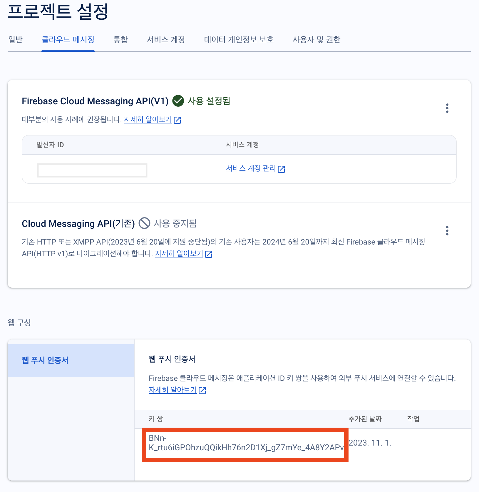
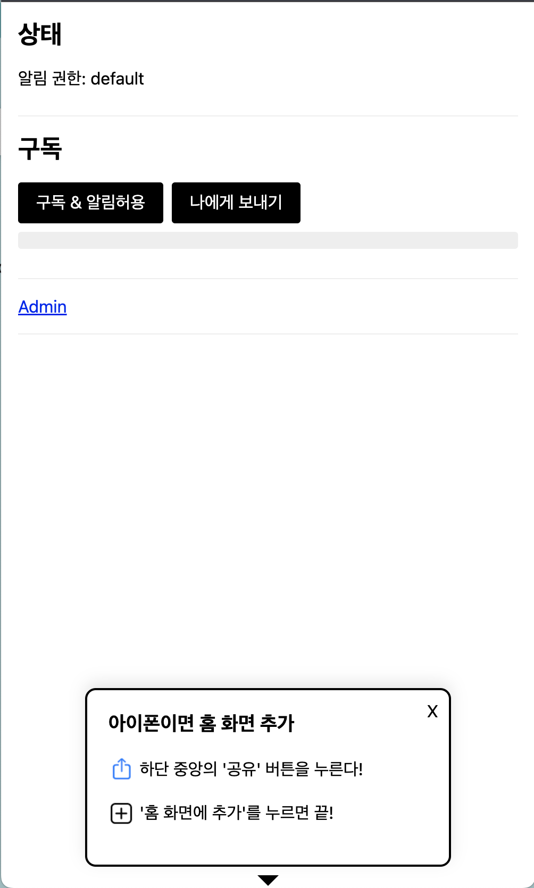

## IOS의 웹 푸시와 웹 앱

지원을 시작하기는 했지만 ios에서 웹푸시를 받기위해서는 조금 까다로운 편에 속합니다. 먼저 Safari에서 해당 웹사이트에 접속, 사이트를 홈화면에 추가 한후 홈화면에서 아이콘을 클릭해 웹앱을 실행해야 푸시 허용을 할수 있게 됩니다.

그리고 아이폰 홈화면에 추가한 웹이 PWA를 지원해야지만 가능합니다.

## FCM으로 구현하기

대다수의 기기와 브라우저, os에서 웹 푸시를 받을 수 있게 되었습니다.

1. FCM SDK 추가 및 초기화

```typescript
const firebaseConfig = {
  apiKey: "",
  authDomain: "",
  projectId: "",
  storageBucket: "",
  messagingSenderId: "",
  appId: "",
}

const app = initializeApp(firebaseConfig)
const messaging = getMessaging(app)
```

2. 푸시 권한

`Notification.requestPermission()` 를 통해 푸시 권한을 요청할 수 있습니다.

```typescript
Notification.requestPermission().then(permission => {
  if (permission !== "granted") {
    // 푸시 거부됐을 때 처리할 내용
  } else {
    // 푸시 승인됐을 때 처리할 내용
  }
})
```

> 참고로 Notification.requestPermission() 을 통한 권한 요청은 사용자의 클릭을 통해서 호출되도록 하는 것을 권장한다.

3. 토큰 발급

토큰의 역할은 문자를 보낼 때 필요한 수령인의 번호와 같다고 생각하면 된다. 따라서 푸시 권한을 부여받고 토큰을 발급 받았다면 해당 토큰들 저장해 둡니다.



vapid key가 준비되었다면 아래와 같이 토큰을 발급 받을 수 있습니다.

```typescript
const messaging = getMessaging()

getToken(messaging, {
  vapidKey: [vapid key],
})
  .then(async currentToken => {
    if (!currentToken) {
      // 토큰 생성 불가시 처리할 내용, 주로 브라우저 푸시 허용이 안된 경우에 해당한다.
    } else {
      // 토큰을 받았다면 호다닥 서버에 저장
    }
  })
  .catch(error => {
    // 예외처리
  })
```

## ServiceWorker

이제 백그라운드에서 푸시를 받고 처리해 줄 서비스워커를 등록해야 합니다.
public 디렉토리에 `firebase-messaging-sw.js` 파일을 생성합니다.

> FCM을 이용해 웹푸시를 전송하기 위해서는 서비스워커 파일명을 반드시 firebase-messaging-sw.js로 해야 합니다.

```javascript
importScripts(
  "https://www.gstatic.com/firebasejs/10.5.0/firebase-app-compat.js"
)
importScripts(
  "https://www.gstatic.com/firebasejs/10.5.0/firebase-messaging-compat.js"
)

const config = {
  apiKey: "",
  authDomain: "",
  projectId: "",
  storageBucket: "",
  messagingSenderId: "",
  appId: "",
}

//Initialize Firebase
firebase.initializeApp(config)
const messaging = firebase.messaging()

// 푸시 전송
self.addEventListener("push", async event => {
  if (event.data) {
    log("push data", event.data.json())

    // const { data } = event.data.json();
    const data = event.data.json().data
    log("icon", data.icon)

    const options = {
      body: data.body,
      icon: data.icon ?? "/icons/icon-256.png",
      image: data.image,
      data: {
        click_action: data.click_action, // 이 필드는 밑의 클릭 이벤트 처리에 사용됨
      },
    }
    event.waitUntil(self.registration.showNotification(data.title, options))
  }
})

//푸시 클릭시 이동 사이트
self.addEventListener("notificationclick", event => {
  log("push", { event })
  event.notification.close()
  try {
    const openLink = event.notification.data.click_action
    self.clients.openWindow(openLink)
  } catch {
    self.clients.openWindow("https://devtimes.com")
  }
})
```

## 푸시 발송

FCM으로 푸시를 발송할 수 있는 방법은 여러가지가 있습니다. 여기서는 firebase admin sdk를 이용하여 발송 api를 구현해 보겠습니다. nextjs에는 api routes 기능이 존재하기 때문에 서버측 api를 간단하게 생성할 수 있습니다.

- firebase-admin 설치

  ```
  npm i firebase-admin --save
  ```

- 서비스 계정 키 준비
  파이어베이스의 프로젝트 설정 -> 서비스 계정에서 새 비공개 키 생성 버튼을 클릭해 json 파일을 다운로드 하고 이파일을 환경 변수에 잘 저장해둡니다. 아래와 같이 생긴 파일 입니다.

  ```javascript
  {
    "type": "...",
    "project_id": "...",
    "private_key_id": "...",
    "private_key": "...",
    "client_email": "...",
    "client_id": "...",
    "auth_uri": "https://accounts.google.com/o/oauth2/auth",
    "token_uri": "https://oauth2.googleapis.com/token",
    "auth_provider_x509_cert_url": "https://www.googleapis.com/oauth2/v1/certs",
    "client_x509_cert_url": "...",
    "universe_domain": "googleapis.com"
  }

  ```

### API 파일 생성

lib/firebase-admin-sdk.ts

```typescript
var firebaseAdmin = require("firebase-admin")
var serviceAccount = require("public/data/firebase-adminsdk.json")

if (firebaseAdmin.apps.length == 0) {
  firebaseAdmin.initializeApp({
    credential: firebaseAdmin.credential.cert(serviceAccount),
  })
}

export default firebaseAdmin
```

api/push/route.ts

```typescript
import firebaseAdmin from "@/lib/firebase-admin-sdk"
import { NextResponse, NextRequest } from "next/server"

export async function POST(request: NextRequest) {
  const reqBody = await request.json()
  const { deviceToken, title, body, icon, image, click_action } = reqBody

  const message = {
    token: deviceToken,
    data: {
      title,
      body,
      icon,
      image,
      click_action,
    },
  }

  console.log("🚀🚀🚀 FCM Send Message 🚀🚀🚀\n", message)

  //단일
  try {
    await firebaseAdmin.messaging().send(message)
    return NextResponse.json({ success: true, message: "전송완료" })
  } catch (error: any) {
    console.log("[ERROR] : ", error.errorInfo)
    return NextResponse.json({ success: false, message: "전송실패" })
  }
}
```

프로젝트를 실행하면 아래와 같은 테스트 화면을 볼수 있습니다. 아이폰의 경우 먼저 앱설치가 진행이 되어야 하기 대문에 그림과 같은 안내가 필요할 것 같습니다.

<!--  -->


## 마치며

안드로이드나 PC의 경우 앞서 설명한 PWA가 아니더라고 웹푸시 구독이 가능하지만, 아이폰의 경우 웹푸시를 받기 위해서는 반드시 PWA 상태에서만 가능합니다. 좀 까탈스럽다고 생각할 수도 있겠지만 저는 오히려 아이폰의 방향성이 맞다고 생각합니다. PWA는 결국 사용자에게 마치 앱을 사용하는 것과 같은 경험을 주고 거기에 웹푸시와 같은 기능을 제공 받을수 있다는 면에서 PWA와 웹푸시는 함께 가야 할 것 입니다. PWA가 아님에도 알림을 사용할 수 있게 해서인지 인터넷 사이트에 돌아다녀 보면 반 강제적인 알림 허용을 유도하고 알림을 허용한 유저들은 이 알림 해지를 하기 위해서 어떻게 해야하는지를 잘 몰라서 인지 알림 허용해지하는 방법의 글들이 많이 게시 되어있는것 같습니다.

샘플은 아래 github에 올려두었으니, 참고하세요.

- FCM 사용 : https://github.com/winuss/pwa-app-fcm
- FCM X : https://github.com/winuss/pwa-app
