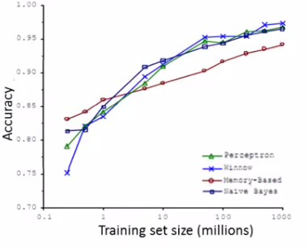
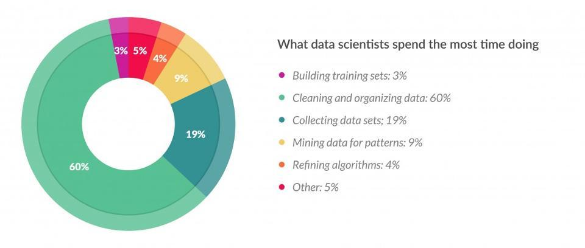
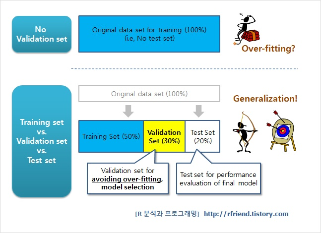

머신러닝은 어떤 `데이터`로 어떤 학습 `알고리즘`을 사용할 것인가를 결정하는 작업이라고 할수 있다. 여기서 문제가 될수 있는 나쁜 알고리즘과 나쁜 데이터에 대해 알아보도록 하자.

### 충분하지 않은 데이터

어린아이에게 사과에 대해 알려주려면 사과를 가리키면서 ‘사과’라고 말하기만 하면 된다(아마도 이 과정을 여러 번 반복해야 하겠지만..). 그러면 아이는 결국 색깔과 모양이 달라도 모든 종류의 사과를 구분할 수 있게 된다. 하지만 머신러닝에서 사과를 구분할 수 있도록 알고리즘이 잘 작동하려면 데이터가 많아야 한다. 아주 간단한 문제에서 조차도 수천 개의 데이터가 필요하고 이미지나 음성 인식 같은 복잡한 문제라면 수백만 개가 필요할지도 모른다.

>"It's not who has the best algorithm that wins. It's who has the most data"

AI 전문가이자 스탠포드 교수인 앤듀르 응(Andrew Ng)의 말이다. 정교한 알고리즘을 설계하는 것 이상으로 많은 데이터를 이용하는 것이 효과적이다. 정교한 알고리즘과 많은 데이터가 가장 정확한 결과를 얻을 수 있겠지만, 시간과 돈을 알고리즘 개발에 쓰는 것과 데이터를 잘 활용하는것 사이의 트레이드 오프에 대해 다시한번 생각해 봐야 한다는 것이다.

(참고 논문 : 믿을 수 없는 데이터의 효과 [http://goo.gl/KNZMEA](http://goo.gl/KNZMEA))

### 대표성 없는 학습 데이터

일반화가 잘되려면 우리가 일반화하기 원하는 새로운 사례를 학습 데이터가 잘 대표하는 것이 중요하다. 대표성을 가지는 데이터를 사용하는 것이 가장 좋지만, 결코 쉬운일은 아니다.
샘플이 작으면 샘플링 잡음(Sampling Noise)이 생기고, 표본 추출 방법이 잘못되면 대표성을 띄지 못할 수 있습니다. 이를 샘플링 편향(Sampling Bias)이라고 한다.

### 샘플링 편향 사례
샘플링 편향에 대한 유명한 사례중 랜던(Randon)과 루즈벨트(Roosevelt)가 경쟁했던 1936년 미국 대통령 선거에서 Literary Digest 잡지사가 천만 명에게 우편물을 보내 수행한 대규모 여론조사가 있다. 그 당시 240만 명의 응답을 받았고 랜던이 선거에서 57% 득표를 얻을 것이라고 높은 신뢰도로 예측했지만, 루즈벨트가 62% 득표로 당선되었다. 문제는 Literary Digest의 샘플링 방법에 있었다고 한다.

첫째, 여론조사용 주소를 얻기 위해 전화번호부, 자사의 구독자 명부, 클럽 회원 명부 등을 사용했다. 이런 명부는 모두 공화당(따라서 랜던)에 투표할 가능성이 높은 부유한 계층에 편중된 경향이 있다.

둘째, 우편물 수신자 중 25% 미만의 사람이 응답했다. 이는 정치에 관심 없는 사람, Literary Digest를 싫어하는 사람과 다른 중요한 그룹을 제외시킴으로써 역시 표본을 편향되게 만들게 된 것이다. 특히 이러한 종류의 샘플링 편향을 비응답 편향(nonresponse bias)이라고 한다.

### 낮은 품질의 데이터

학습 데이터가 에러, 이상치, 잡음으로 가득하다면 머신러닝 시스템이 내재되어 있는 패턴을 찾기 어려울 수 있다. 그 만큼 데이터의 전처리가 매우 중요하다. 한 설문조사에서는 데이터과학자의 **80% 시간을 데이터 수집 및 전처리**에 사용한다고 한다. 아마도 전처리 과정은 특히나 지루하고 반복 작업의 연속이라 고단하고 시간도 많이 들어어가게 된다.

### 관련 없는 특성

학습 데이터에 관련 없는 특성이 적고 관련 있는 특성이 충분해야 학습을 진행할 수 있다.
훈련에 사용할 좋은 특성들을 찾아야 하며, 특성을 찾기 위해서는 아래 사항을 고려 해야 한다.

- 특성 선택 (Feature Selection) : 가지고 있는 특성 중에서 학습에 가장 유용한 특성을 선택.
- 특성 추출 (Feature Extraction) : 특성을 결합하여 더 유용한 특성을 만듬. 혹은 새로운 데이터를 수집하여 새로운 특성을 만듬.

지금까지 나쁜 데이터의 사례를 살펴보았고 이제 나쁜 알고리즘의 경우를 살펴보자.

### 학습 데이터의 과대적합

모델이 학습 데이터에 너무 잘 맞지만 일반성이 떨어진다는 의미이다.
훈련 데이터에 있는 잡음의 양에 비해 모델이 너무 복잡할 때 발생하기 때문에 좀더 단순화 시킬 필요가 있다.

- 파라미터 수가 적은 모델 선택, 훈련데이터에 특성수를 줄임, 모델에 제약을 가하여 단순화
- 훈련 데이터를 더 많이 모음
- 훈련 데이터의 잡음을 줄임

### 학습 데이터 과소적합

모델이 너무 단순해서 데이터의 내재된 구조를 학습하지 못한것을 의미한다.

- 파라미터가 더 많은 강력한 모델 선택
- 더 좋은 특성 제공(특성 엔지니어링)
- 모델의 제약을 줄임(규제 하이퍼파라미터를 감소)

좋은 모델을 만들기 위해서는 테스트와 검증이 필요하다. 이는 일반화 오류를 최소화 하기위한 방법이기도 하다. 일반적으로 모델을 만들기 위해서는 데이터를 훈련셋, 검증셋, 테스트셋으로 나누어 학습을 진행을 한다.

### 마치며...
**"Big Data is the next Natural Resource..."**

과거 원유가 가장 중요한 자원이었다고 한다면 이제는 데이터가 가장 중요한 자원일 것이다. 
그런데 데이터는 과거의 자원들과는 아주 많이 다르다. 데이터는 지속적인 재생, 고갈되지 않는.. 그리고 스스로 증폭하는 새로운 자원이다. 이렇게 중요한 데이터를 올바르게 잘 활용을 하는것이 정말 중요할 것이다. 

**참고한 자료**
강연 : 4차 산업혁명시대 어떻게 살 것인가? - EBS 미래강연Q

도서 : Hands-On Machine Learning - 한빛미디어